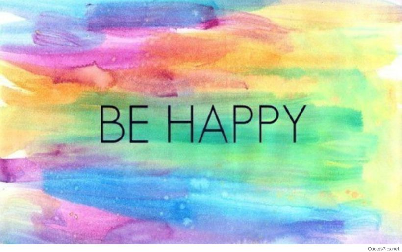

# What's the difference between short term happy moment and long term happy moment?

```{r picture, echo=FALSE, out.width = '100%', echo=FALSE}

```

HappyDB is a corpus of 100,535 crowd-sourced happy moments. The goal of this project is to look deeper to compare the causes between the short term happy moment and long term happy moment. I apply natural language processing, text mining and data manipulation to derive interesting findings in the collection of happy moments.


```{r load libraries, warning=FALSE, message=FALSE, echo=FALSE}
packages.used=c('tm', 'tidytext', 'tidyverse', 'DT', 'ggplot2')

# check packages that need to be installed.
packages.needed=setdiff(packages.used, 
                        intersect(installed.packages()[,1], 
                                  packages.used))
# install additional packages
if(length(packages.needed)>0){
  install.packages(packages.needed, dependencies = TRUE)
}

# load packagess
library(tm)
library(tidytext)
library(tidyverse)
library(DT)
library(ggplot2)
library(ggpubr)
library(plotly)
library(wordcloud)
```


```{r read data, warning=FALSE, message=FALSE, echo=FALSE}
hm_data <- read_csv('cleaned_hm.csv')
demo_data <- read.csv('demographic.csv')
```

```{r, echo=FALSE}
hm_data_24 <- hm_data[which(hm_data$reflection_period == '24h'),]
hm_data_3 <- hm_data[which(hm_data$reflection_period == '3m'),]
demo_data_24 <- filter(demo_data, wid %in% hm_data_24$wid)
demo_data_3 <- filter(demo_data, wid %in% hm_data_3$wid)
```


# Data Summary

Firstly, I check the number of last 24 hours happy moment is 49831 which is very similar with the number of last 3 months happy moment: 50704.


```{r, echo = FALSE}
num_24 <- count(hm_data[which(hm_data$reflection_period == '24h'),])
num_3 <- count(hm_data[which(hm_data$reflection_period == '3m'),])

 plot_ly(x = c('24h', '3m'), y = c(49831, 50704) , type = 'bar', name = '24h',marker = list(color = 'rgb(49,130,189)')) %>%
  layout(yaxis = list(title = 'Count'), barmode = 'group')

```

24 hours country frequency
```{r, echo = FALSE}
count_24_country <- table(demo_data_24$country)
count_24_country[order(-count_24_country)][1:10]
```

3 months country frequency
```{r, echo = FALSE}
count_3_country <- table(demo_data_3$country)
count_3_country[order(-count_3_country)][1:10]
```

24 hours marital frequency
```{r, echo = FALSE}
count_24_marital <- table(demo_data_24$marital)
count_24_marital[order(-count_24_marital)]
```

3 months marital frequency
```{r, echo = FALSE}
count_3_marital <- table(demo_data_3$marital)
count_3_marital[order(-count_3_marital)]
```

24 hours gender frequency
```{r, echo = FALSE}
count_24_gender <- table(demo_data_24$gender)
count_24_gender[order(-count_24_gender)]
```

3 months gender frequency
```{r, echo = FALSE}
count_3_gender <- table(demo_data_3$gender)
count_3_gender[order(-count_3_gender)]
```

24 hours parenthood frequency
```{r, echo = FALSE}
count_24_parenthood <- table(demo_data_24$parenthood)
count_24_parenthood[order(-count_24_parenthood)]
```

3 months parenthood frequency
```{r, echo = FALSE}
count_3_parenthood <- table(demo_data_3$parenthood)
count_3_parenthood[order(-count_3_parenthood)]
```

From above frequency table, we can conclude that comparison on short term happy moment and long term happy moment is not affected by country, marital, gender and parenthood. So next, we can begin to compare. 


## Comparison on Happiness category label 

The Happiness category label predicted by the author (Please see the reference for details) which is 7 categories: **achievement**, **affection**, **bonding**, **enjoy_the_moment**, **exercise**, **leisure**, **nature**. Below is the percentage of each category appears in the collection of the last 24 hours happy moment as well as in the collection of the last 3 months happy moment. 

24 hours happy moment Happiness category label
```{r, echo=FALSE}
t_24 <- table(subset(hm_data, reflection_period == '24h', 
select=c(predicted_category)))
t_3 <- table(subset(hm_data, reflection_period == '3m', 
select=c(predicted_category)))

t_24*100/sum(t_24)
```

3 months happy moment Happiness category label
```{r, echo=FALSE}
t_3*100/sum(t_3)
```

```{r, echo=FALSE}
label <- c('achievement', 'affection', 'bonding', 'enjoy_the_moment',
           'exercise', 'leisure', 'nature')
value_24 <- c(30.980715, 32.818928, 10.477414, 13.341093, 1.531175, 8.695390, 2.155285)
value_3 <- c(36.5947460, 35.1333228, 10.8591038, 8.8671505, 0.8658094, 6.1632218, 1.5166456)
all <- data.frame(label,value_24, value_3)
```


```{r, echo=FALSE}
colors <- c('rgb(211,94,96)', 'rgb(128,133,133)', 'rgb(144,103,167)', 'rgb(171,104,87)', 'rgb(114,147,203)')
par(mfrow=c(1,2))
p1 <- plot_ly(all, labels = ~label, values = ~value_24, type = 'pie',
        textposition = 'inside',
        textinfo = 'label+percent',
        insidetextfont = list(color = '#FFFFFF'),
        hoverinfo = 'text',
        marker = list(colors = colors,
                      line = list(color = '#FFFFFF', width = 1)),
        showlegend = FALSE) %>%
  layout(title = 'Percentage Share of 24h predicted category',
         xaxis = list(showgrid = FALSE, zeroline = FALSE, showticklabels = FALSE),
         yaxis = list(showgrid = FALSE, zeroline = FALSE, showticklabels = FALSE))

 p2 <- plot_ly(all, labels = ~label, values = ~value_3, type = 'pie',
        textposition = 'inside',
        textinfo = 'label+percent',
        insidetextfont = list(color = '#FFFFFF'),
        hoverinfo = 'text',
        marker = list(colors = colors,
                      line = list(color = '#FFFFFF', width = 1)),
        showlegend = FALSE) %>%
  layout(title = 'Percentage Share of 3m predicted category',
         xaxis = list(showgrid = FALSE, zeroline = FALSE, showticklabels = FALSE),
         yaxis = list(showgrid = FALSE, zeroline = FALSE, showticklabels = FALSE))

p1 
p2

```


```{r, echo=FALSE}
plot_ly(all, x = ~label, y = ~value_24, type = 'bar', name = '24h',marker = list(color = 'rgb(49,130,189)')) %>%
  add_trace(y = ~value_3, name = '3m', marker = list(color = 'rgb(204,204,204)')) %>%
  layout(yaxis = list(title = 'Percentage'), barmode = 'group')
```


From above group barplot and pie charts, we can see that when people talking about their happy moment in last 3 months, they are more focus on achievement, affection and bonding. While, when people talking about their happy moment in last 24 hours, they are more focus on enjoy the moment, exercise, leisure and nature.


```{r text processing in tm, echo=FALSE}
corpus_24 <- VCorpus(VectorSource(hm_data_24$cleaned_hm))%>%
  tm_map(content_transformer(tolower))%>%
  tm_map(removePunctuation)%>%
  tm_map(removeNumbers)%>%
  tm_map(removeWords, character(0))%>%
  tm_map(stripWhitespace)

corpus_3 <- VCorpus(VectorSource(hm_data_3$cleaned_hm))%>%
  tm_map(content_transformer(tolower))%>%
  tm_map(removePunctuation)%>%
  tm_map(removeNumbers)%>%
  tm_map(removeWords, character(0))%>%
  tm_map(stripWhitespace)
```


```{r stemming, echo=FALSE}
stemmed_24 <- tm_map(corpus_24, stemDocument) %>%
  tidy() %>%
  select(text)
```


```{r, echo = FALSE}
stemmed_3 <- tm_map(corpus_3, stemDocument) %>%
  tidy() %>%
  select(text)
```


```{r tidy dictionary, echo=FALSE}
dict_24 <- tidy(corpus_24) %>%
  select(text) %>%
  unnest_tokens(dictionary, text)

dict_3 <- tidy(corpus_3) %>%
  select(text) %>%
  unnest_tokens(dictionary, text)
```


```{r stopwords, echo=FALSE}
data("stop_words")

word <- c("happy","ago","yesterday","lot","today","months","month",
                 "happier","happiest","last","week","past","time", "day", "moment")

stop_words <- stop_words %>%
  bind_rows(mutate(tibble(word), lexicon = "updated"))
```


```{r tidy stems with dictionary, echo=FALSE}
completed_24 <- stemmed_24 %>%
  mutate(id = row_number()) %>%
  unnest_tokens(stems, text) %>%
  bind_cols(dict_24) %>%
  anti_join(stop_words, by = c("dictionary" = "word"))

completed_3 <- stemmed_3 %>%
  mutate(id = row_number()) %>%
  unnest_tokens(stems, text) %>%
  bind_cols(dict_3) %>%
  anti_join(stop_words, by = c("dictionary" = "word"))
```


```{r stem completion, warning=FALSE, message=FALSE, echo=FALSE}
completed_24 <- completed_24 %>%
  group_by(stems) %>%
  count(dictionary) %>%
  mutate(word = dictionary[which.max(n)]) %>%
  ungroup() %>%
  select(stems, word) %>%
  distinct() %>%
  right_join(completed_24) %>%
  select(-stems)

completed_3 <- completed_3 %>%
  group_by(stems) %>%
  count(dictionary) %>%
  mutate(word = dictionary[which.max(n)]) %>%
  ungroup() %>%
  select(stems, word) %>%
  distinct() %>%
  right_join(completed_3) %>%
  select(-stems)
```

### Comparison on the most frequent words

24 hours most 20 frequent words
```{r, echo=FALSE}
count_24 <- table(completed_24$word)
count_24[order(-count_24)][1:20]
```

3 months most 20 frequent words
```{r, echo = FALSE}
count_3 <- table(completed_3$word)
count_3[order(-count_3)][1:20]

m_24 <- as.matrix(count_24[order(-count_24)])
v_24 <- sort(rowSums(m_24),decreasing=TRUE)
d_24 <- data.frame(word = names(v_24),freq=v_24)

m_3 <- as.matrix(count_3[order(-count_3)])
v_3 <- sort(rowSums(m_3),decreasing=TRUE)
d_3 <- data.frame(word = names(v_3),freq=v_3)
```


### Word cloud
24 hours Word Cloud
```{r, echo=FALSE}
set.seed(123)
wordcloud(words = d_24$word, freq = d_24$freq, min.freq = 1,
          max.words=200, random.order=FALSE, rot.per=0.35, 
          colors=brewer.pal(8, "Dark2"))
```

3 months Word Cloud
```{r, echo = FALSE}
set.seed(121)
wordcloud(words = d_3$word, freq = d_3$freq, min.freq = 1,
          max.words=200, random.order=FALSE, rot.per=0.35, 
          colors=brewer.pal(8, "Dark2"))

```

**Friend**, **family**, **son**, **daughter** are always the most common words in the happy moment both in last 24 hours and last 3 months. So obviously the key to be happy is spending more time with friends and family. 

In the last 24 hours dataset, **watched**, **game** appear more frequently. Which means game, tv show, film are really a good way to relax people and make them feel happy immediately in daily life. Additionally **night**, **morning** are also very common in the last 24 hours. So a good begining and ending of the day can make someone's day. Moreover **dinner** is the 6th most frequent words in the last 24 hours dataset, which we can see that dinner is the most important meal in a day and food can make people feel good quickly.

In contrast, **event**, **birthday** appear more frequently in the last 3 months. It is resonable because people easily think over and remember some great event and something can change their life when they are asked about the happy moment in a longer period. People needs holiday and event to refesh themselves and get reunion with their family and friends to make them feel great. The other common words are **job**, **bought**. It's also imaginable because job is really important in the life and shopping is usually a way to decompress. And I feel a little surprised to see **bought** is in the common words of the last 3 month instead of the last 24 hours. This shows shopping is a good way to be relaxed and help people be happy in a long term.  


#Summary
```{r summary, echo=FALSE, out.width = '100%', echo=FALSE}
knitr::include_graphics("happy3.jpg")
```

1) Spending time with family and friends are the best way to be happy both in the long term and short term.   
2) Watch tv, play game, great food are a quick way to make people happy in a short term.
3) Event, job, shopping are the methods to keep people happy for a longer term.


#References

Akari Asai, Sara Evensen, Behzad Golshan, Alon Halevy, Vivian Li, Andrei Lopatenko, 
Daniela Stepanov, Yoshihiko Suhara, Wang-Chiew Tan, Yinzhan Xu, 
``HappyDB: A Corpus of 100,000 Crowdsourced Happy Moments'', LREC '18, May 2018. (to appear)
   
https://github.com/rit-public/HappyDB


